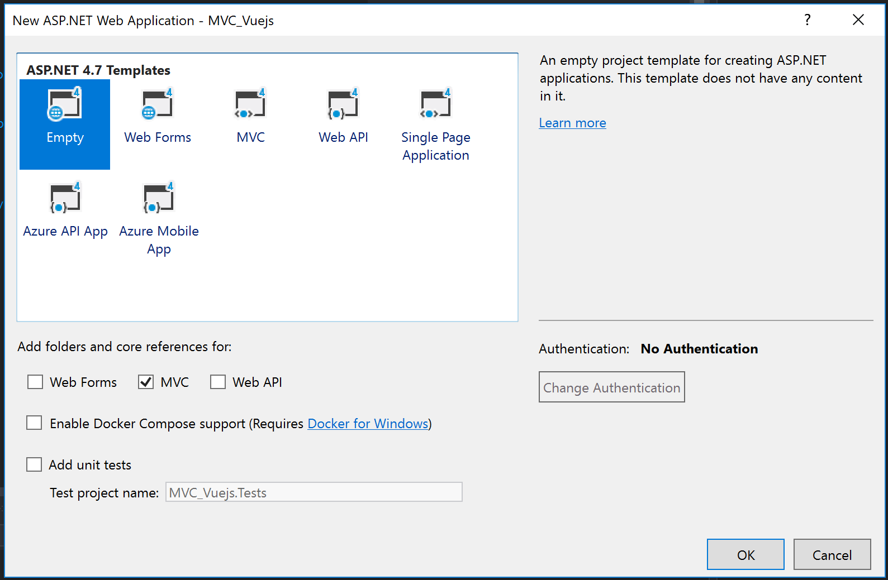

# Vue.js-ASP.NET-MVC-intergration
How to integrate Vue.js into an existing ASP.Net MVC (not Core!) application (including development integration)

## Motivation

Imaging one has an existing ASP.NET MVC project and wants to add some Vue.js components to it. One would like to keep the sources for the MVC and the Vue.js parts in a single solution and of course get the MVC application updated after some change in the Vue.js components occurs without manual copy of files between the solution folders.

I will show a working solution for a simple straightforward setup (with almost no constraints). 

## The Scenario

We will start with an empty Asp.Net MVC Project. Then we will add only one trivial controller/action/view. Simultaneously we will setup a new Vue.js project and add it to the same Visual Studio solution. We will use the Vue.js CLI for that and we will build a multipage project (multiple entry points) - with two different pages (components). At the end we will integrate this 2 Vue.js components into the MVC view we created at the start.

## Software Versions

At the time of writing I have Visual Studio Professional 2017/ Version 15.9.11 with .NET 4.7 and Vue.js CLI 3.7.0 and Vue.js 2.6.10.

## The ASP.NET MVC Project




The we add `MVC 5 Controller - Empty` to the `Controllers` folder. We name it `HomeController` and leave the generated code as it is:
```csharp
using System;
using System.Collections.Generic;
using System.Linq;
using System.Web;
using System.Web.Mvc;

namespace MVC_Vuejs.Controllers
{
    public class HomeController : Controller
    {
        // GET: Home
        public ActionResult Index()
        {
            return View();
        }
    }
}
```

The reason behind the name `HomeController` is that this is the name of the `Default` route in the `RouteConfig.cs`. So in this way the `Index` action will be automatically executed when the website is opened in the browser without  further configuration.

Further we define the view for the `Index` action. Just right-click inside the `Index()` method and select `Add View ...`:
